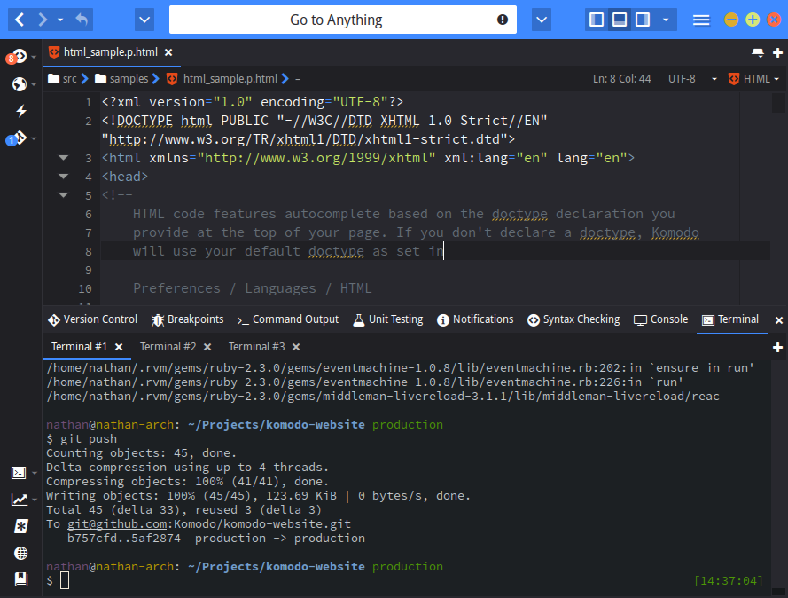

This adds a tabbed terminal to the bottom panel in Komodo. It is powered by
butterfly.

Current state is operational but likely to contain some bugs. Only works on
Komodo 10 [and Unix systems. (Linux & OSX)](https://github.com/Defman21/komodo-terminal-butterfly/issues/1#issuecomment-221905818)

For Windows users, you should use cygwin to get this add-on working.

# Customizing Terminal

If you don't like the default style of Terminal, you can customize it
in Color Scheme Editor. Open it, select Interface item in the dropdown list and
start customizing. (if there are opened tabs, you have to re-open them to
see your changes).

[See Wiki for code examples.](https://github.com/Defman21/komodo-terminal-butterfly/wiki/Customizing-Terminal)

# Authors

This addon was originally developed by [Nathan Rijksen](https://github.com/Naatan) and is currently maintained by [Sergey Kislyakov](https://github.com/Defman21)
